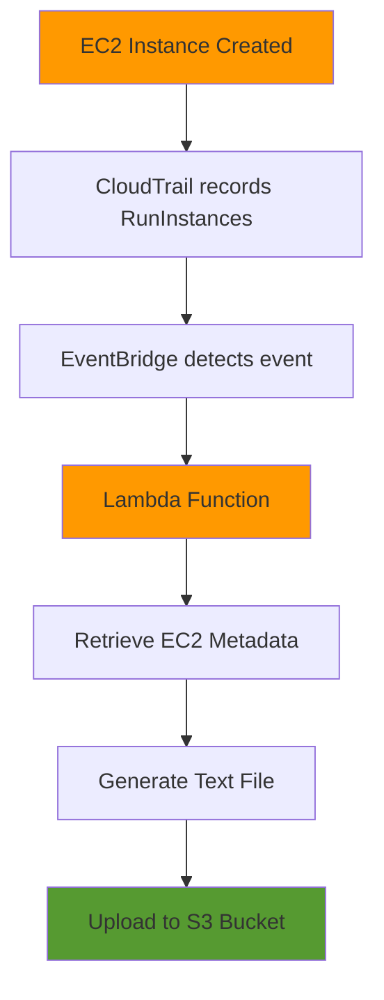

# EC2 Metadata Collector Lambda

[](https://www.terraform.io/)
[](https://aws.amazon.com/lambda/)
[](https://www.python.org/)

## Overview

An event-driven serverless solution that automatically captures and stores EC2 instance metadata whenever new instances are launched. This Terraform module deploys a complete AWS infrastructure using Lambda, EventBridge, CloudTrail, and S3 to enable real-time EC2 metadata collection.

## Architecture



## Table of Contents

- [Features](#features)
- [Prerequisites](#prerequisites)
- [Quick Start](#quick-start)
- [AWS Resources](#aws-resources)
- [Configuration](#configuration)
- [Deployment](#deployment)
- [Usage Example](#usage-example)
- [Outputs](#outputs)
- [Monitoring](#monitoring)
- [Troubleshooting](#troubleshooting)
- [Security Considerations](#security-considerations)

## Features

✅ **Automated Detection** - Automatically triggers on EC2 instance creation  
✅ **Serverless** - No infrastructure management required  
✅ **Event-Driven** - Real-time metadata collection via EventBridge  
✅ **Audit Trail** - All actions logged through CloudTrail  
✅ **Scalable** - Handles multiple EC2 launches concurrently  
✅ **Cost-Effective** - Pay only for what you use

## Prerequisites

Before deploying this module, ensure you have:

- **Terraform** >= 0.13 installed
- **AWS CLI** configured with appropriate credentials
- **AWS Account** with the following enabled:
  - CloudTrail (management events)
  - S3 bucket for metadata storage
- **IAM Permissions** to create:
  - Lambda functions
  - IAM roles and policies
  - EventBridge rules
  - S3 buckets

## Quick Start

```bash
# Clone the repository
git clone <repository-url>
cd terraform-aws-infrastructure/lambda

# Initialize Terraform
terraform init

# Review the plan
terraform plan

# Deploy the infrastructure
terraform apply
```

## AWS Resources

1. Amazon EC2
Purpose

Amazon EC2 (Elastic Compute Cloud) provides virtual machines in the AWS Cloud. In this project, launching an EC2 instance acts as the event that triggers the entire workflow.

How It Is Used
Launch a new EC2 instance.
CloudTrail records the RunInstances API call.
EventBridge detects the event.
Lambda retrieves metadata about the instance.
How to Create
Open the AWS Console.
Navigate to EC2.
Click Launch Instance.
Enter an instance name.
Select an Amazon Machine Image (AMI).
Choose an instance type (e.g., t2.micro).
Create or select an existing key pair.
Configure the security group.
Click Launch Instance.


2. Amazon S3
Purpose

Amazon S3 is used to store the metadata collected from EC2 instances.

Each EC2 instance generates one metadata file that is uploaded automatically by the Lambda function.

Example:

ec2-metadata-storage/
└── ec2-metadata/
      ├── i-0123456789abcdef.txt
      ├── i-045678912345678.txt
      └── i-078945612378945.txt
How It Is Used

Lambda uploads metadata files to the bucket using the PutObject API.

How to Create
Open Amazon S3.
Click Create bucket.
Enter a globally unique bucket name.
Choose your AWS Region.
Leave the default settings (or configure as required).
Click Create bucket.
3. AWS Lambda
Purpose

AWS Lambda is the serverless compute service responsible for processing EC2 creation events.

It automatically executes Python code without provisioning or managing servers.

Responsibilities
Receive EventBridge events.
Extract the EC2 Instance ID.
Retrieve metadata using the EC2 API.
Generate a text file.
Upload the file to Amazon S3.
How to Create
Open AWS Lambda.
Click Create Function.
Select Author from scratch.
Enter a function name.
Choose Python 3.x as the runtime.
Select or create an execution role.
Click Create Function.
Add your Python code.
Deploy the function.
4. IAM (Identity and Access Management)
Purpose

IAM controls permissions for AWS resources.

The Lambda execution role allows the function to:

Read EC2 metadata
Upload files to S3
Write logs to CloudWatch
Required Permissions
ec2:DescribeInstances

s3:PutObject

logs:CreateLogGroup

logs:CreateLogStream

logs:PutLogEvents
How to Create the Lambda Execution Role
Open IAM.
Navigate to Roles.
Click Create Role.
Select AWS Service.
Choose Lambda.
Attach the following policies:
AmazonEC2ReadOnlyAccess
AmazonS3FullAccess (for learning purposes)
AWSLambdaBasicExecutionRole
Name the role (e.g., Lambda-EC2MetadataRole).
Click Create Role.
5. AWS CloudTrail
Purpose

CloudTrail records all AWS API activity within your account.

When an EC2 instance is launched, CloudTrail records the RunInstances API call. EventBridge listens for this event.

How It Is Used

Launch EC2
      │
      ▼
CloudTrail Records API Call
      │
      ▼
EventBridge Receives Event
How to Create
Open CloudTrail.
Click Create Trail.
Enter a trail name.
Enable Management Events.
Select Read/Write Events.
Create the trail.
6. Amazon EventBridge
Purpose

Amazon EventBridge routes AWS events to target services.

In this project, it detects EC2 creation events and invokes the Lambda function.

Event Pattern
{
  "source": ["aws.ec2"],
  "detail-type": ["AWS API Call via CloudTrail"],
  "detail": {
    "eventSource": ["ec2.amazonaws.com"],
    "eventName": ["RunInstances"]
  }
}
How to Create
Open Amazon EventBridge.
Navigate to Rules.
Click Create Rule.
Enter a rule name.
Select Event Pattern.
Choose Custom Pattern.
Paste the JSON event pattern.
Select Lambda Function as the target.
Choose your Lambda function.
Click Create Rule.
7. Amazon CloudWatch
Purpose

CloudWatch stores Lambda execution logs.

It helps monitor application execution and troubleshoot issues.

Example log output:

START RequestId: xxxxxxxxx

Received Event

Extracted Instance ID

Metadata Uploaded Successfully

END RequestId: xxxxxxxxx
How to Access Logs
Open CloudWatch.
Select Log Groups.
Open:
/aws/lambda/EC2MetadataCollector
Select the latest log stream.
Review the execution logs.
Project Workflow

```
                Launch EC2 Instance
                        │
                        ▼
                AWS CloudTrail
         Records RunInstances Event
                        │
                        ▼
              Amazon EventBridge
            Detects Matching Event
                        │
                        ▼
                AWS Lambda Executes
                        │
      ┌─────────────────┴─────────────────┐
      │                                   │
      ▼                                   ▼
Retrieve EC2 Metadata             Format Text File
      │                                   │
      └─────────────────┬─────────────────┘
                        ▼
                 Upload File to S3
                        │
                        ▼
           EC2 Metadata Successfully Stored

```
