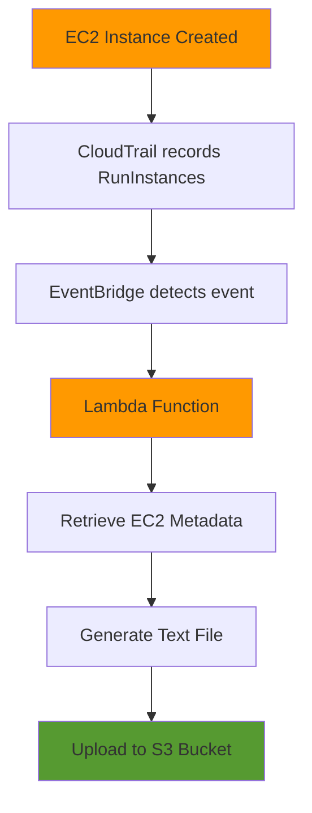

# EC2 Metadata Collector Lambda

[](https://www.terraform.io/)
[](https://aws.amazon.com/lambda/)
[](https://www.python.org/)

## Overview

An event-driven serverless solution that automatically captures and stores EC2 instance metadata whenever new instances are launched. This Terraform module deploys a complete AWS infrastructure using Lambda, EventBridge, CloudTrail, and S3 to enable real-time EC2 metadata collection.

## Architecture



## Table of Contents

- [Features](#features)
- [Prerequisites](#prerequisites)
- [Quick Start](#quick-start)
- [AWS Resources](#aws-resources)
- [Configuration](#configuration)
- [Deployment](#deployment)
- [Usage Example](#usage-example)
- [Outputs](#outputs)
- [Monitoring](#monitoring)
- [Troubleshooting](#troubleshooting)
- [Security Considerations](#security-considerations)

## Features

✅ **Automated Detection** - Automatically triggers on EC2 instance creation  
✅ **Serverless** - No infrastructure management required  
✅ **Event-Driven** - Real-time metadata collection via EventBridge  
✅ **Audit Trail** - All actions logged through CloudTrail  
✅ **Scalable** - Handles multiple EC2 launches concurrently  
✅ **Cost-Effective** - Pay only for what you use

## Prerequisites

Before deploying this module, ensure you have:

- **Terraform** >= 0.13 installed
- **AWS CLI** configured with appropriate credentials
- **AWS Account** with the following enabled:
  - CloudTrail (management events)
  - S3 bucket for metadata storage
- **IAM Permissions** to create:
  - Lambda functions
  - IAM roles and policies
  - EventBridge rules
  - S3 buckets

## Quick Start

```bash
# Clone the repository
git clone <repository-url>
cd terraform-aws-infrastructure/lambda

# Initialize Terraform
terraform init

# Review the plan
terraform plan

# Deploy the infrastructure
terraform apply
```

## AWS Resources

This module provisions and integrates the following AWS services:

| Service | Purpose | Role in Workflow |
|---------|---------|------------------|
| **Amazon EC2** | Compute instances | Trigger source for the automation |
| **AWS Lambda** | Serverless compute | Executes metadata collection logic |
| **Amazon S3** | Object storage | Stores collected metadata files |
| **AWS CloudTrail** | API activity logging | Records `RunInstances` API calls |
| **Amazon EventBridge** | Event routing | Detects EC2 creation and triggers Lambda |
| **AWS IAM** | Access management | Provides Lambda execution permissions |
| **Amazon CloudWatch** | Monitoring & logging | Tracks Lambda execution logs |

### Event Flow

```
Launch EC2 → CloudTrail Records → EventBridge Detects → Lambda Executes → S3 Storage
```

## Configuration

### Module Variables

```hcl
variable "function_name" {
  description = "Name of the Lambda function"
  type        = string
  default     = "ec2-metadata-collector"
}
```

### Lambda Function Details

- **Runtime**: Python 3.12
- **Handler**: `index.lambda_handler`
- **Source Path**: `../src/lambda-function1`
- **Memory**: Default (128 MB)
- **Timeout**: Default (3 seconds)

### Required IAM Permissions

The Lambda execution role requires the following permissions:

```json
{
  "Version": "2012-10-17",
  "Statement": [
    {
      "Effect": "Allow",
      "Action": [
        "ec2:DescribeInstances",
        "ec2:DescribeInstanceStatus",
        "ec2:DescribeTags"
      ],
      "Resource": "*"
    },
    {
      "Effect": "Allow",
      "Action": [
        "s3:PutObject",
        "s3:PutObjectAcl"
      ],
      "Resource": "arn:aws:s3:::your-bucket-name/*"
    },
    {
      "Effect": "Allow",
      "Action": [
        "logs:CreateLogGroup",
        "logs:CreateLogStream",
        "logs:PutLogEvents"
      ],
      "Resource": "arn:aws:logs:*:*:*"
    }
  ]
}
```

### EventBridge Rule Pattern

```json
{
  "source": ["aws.ec2"],
  "detail-type": ["AWS API Call via CloudTrail"],
  "detail": {
    "eventSource": ["ec2.amazonaws.com"],
    "eventName": ["RunInstances"]
  }
}
```

## Deployment

### Step 1: Prepare Lambda Source Code

Ensure your Lambda function code is in `../src/lambda-function1/index.py`:

```python
import boto3
import json
from datetime import datetime

def lambda_handler(event, context):
    # Extract instance ID from event
    instance_id = event['detail']['responseElements']['instancesSet']['items'][0]['instanceId']
    
    # Collect metadata
    ec2 = boto3.client('ec2')
    response = ec2.describe_instances(InstanceIds=[instance_id])
    
    # Generate and upload to S3
    s3 = boto3.client('s3')
    # ... rest of your Lambda code
```

### Step 2: Configure Variables

Create a `terraform.tfvars` file:

```hcl
function_name = "my-ec2-metadata-collector"
```

### Step 3: Deploy

```bash
terraform init
terraform plan -out=tfplan
terraform apply tfplan
```

### Step 4: Verify Deployment

```bash
# Check Lambda function
aws lambda list-functions --query "Functions[?FunctionName=='ec2-metadata-collector']"

# Check EventBridge rule
aws events list-rules --name-prefix ec2-metadata

# Test by launching an EC2 instance
aws ec2 run-instances --image-id ami-xxxxx --instance-type t2.micro --count 1
```

## Usage Example

### Basic Usage

```hcl
module "ec2_metadata_lambda" {
  source = "./lambda"

  function_name = "ec2-metadata-collector"
}
```

### With Custom Configuration

```hcl
module "ec2_metadata_lambda" {
  source = "./lambda"

  function_name = "production-ec2-metadata-collector"
  
  tags = {
    Environment = "production"
    Project     = "infrastructure-automation"
    ManagedBy   = "terraform"
  }
}
```

## Outputs

| Output Name | Description | Example Value |
|-------------|-------------|---------------|
| `lambda_function_arn` | ARN of the Lambda function | `arn:aws:lambda:us-east-1:123456789012:function:ec2-metadata-collector` |
| `lambda_function_name` | Name of the Lambda function | `ec2-metadata-collector` |
| `lambda_role_arn` | ARN of the Lambda execution role | `arn:aws:iam::123456789012:role/lambda-exec-role` |

## Monitoring

### CloudWatch Logs

View Lambda execution logs:

```bash
aws logs tail /aws/lambda/ec2-metadata-collector --follow
```

### Expected Log Output

```
START RequestId: abc123-def456-ghi789
[INFO] Received EC2 creation event
[INFO] Instance ID: i-0123456789abcdef0
[INFO] Collecting metadata...
[INFO] Metadata collected successfully
[INFO] Uploading to S3: ec2-metadata/i-0123456789abcdef0.txt
[INFO] Upload successful
END RequestId: abc123-def456-ghi789
REPORT Duration: 234.56 ms  Billed Duration: 235 ms  Memory Size: 128 MB  Max Memory Used: 45 MB
```

### CloudWatch Metrics

Monitor these key metrics:
- **Invocations** - Number of times Lambda is triggered
- **Errors** - Failed executions
- **Duration** - Execution time
- **Throttles** - Rate-limited invocations

## Troubleshooting

### Lambda Not Triggering

**Problem**: EC2 instances launch but Lambda doesn't execute

**Solutions**:
1. Verify CloudTrail is enabled for management events
2. Check EventBridge rule is active: `aws events describe-rule --name <rule-name>`
3. Confirm Lambda has EventBridge trigger permission
4. Review CloudWatch logs for errors

### Permission Denied Errors

**Problem**: Lambda fails with access denied

**Solutions**:
1. Verify IAM role has `ec2:DescribeInstances` permission
2. Check S3 bucket policy allows Lambda to write
3. Review Lambda execution role trust policy
4. Ensure CloudWatch Logs permissions are granted

### Metadata File Not in S3

**Problem**: Lambda executes but file doesn't appear in S3

**Solutions**:
1. Check S3 bucket name in Lambda code
2. Verify S3 bucket exists and is in correct region
3. Review Lambda CloudWatch logs for S3 upload errors
4. Confirm S3 bucket policy allows PutObject

### Common Error Messages

| Error | Cause | Solution |
|-------|-------|----------|
| `AccessDeniedException` | Missing IAM permissions | Add required permissions to Lambda role |
| `NoSuchBucket` | S3 bucket doesn't exist | Create bucket or update bucket name |
| `InvalidInstanceID.NotFound` | Instance ID not found | Check event parsing logic |
| `Timeout` | Lambda execution time exceeded | Increase timeout in Lambda configuration |

## Security Considerations

### Best Practices

✅ **Least Privilege**: Grant only necessary IAM permissions  
✅ **Encryption**: Enable S3 bucket encryption at rest  
✅ **VPC**: Deploy Lambda in VPC for network isolation (if needed)  
✅ **Secrets Management**: Use AWS Secrets Manager for sensitive data  
✅ **CloudTrail**: Keep CloudTrail logs in separate, secured S3 bucket  
✅ **Monitoring**: Enable CloudWatch alarms for failed invocations

### IAM Role Naming Convention

Per [AWS IAM Best Practices](https://github.com/kodekloudhub/community-faq/blob/main/docs/playgrounds.md#aws-iam):
- Use descriptive names: `lambda_ec2_metadata_collector_role`
- Include purpose and service type
- Avoid generic names like `lambda_role`

## S3 Bucket Structure

Metadata files are organized as follows:

```
ec2-metadata-storage/
└── ec2-metadata/
    ├── i-0123456789abcdef0.txt
    ├── i-0abcdef123456789.txt
    └── i-089abcdef01234567.txt
```

Each file contains:
- Instance ID
- Instance Type
- Launch Time
- Availability Zone
- Private IP Address
- Public IP Address (if assigned)
- Security Groups
- Tags

## Cost Estimation

**Estimated monthly cost for moderate usage:**

| Service | Usage | Cost |
|---------|-------|------|
| Lambda | 1000 invocations/month | ~$0.20 |
| S3 Storage | 1 GB | ~$0.023 |
| CloudTrail | Management events | $0.00 (first trail free) |
| EventBridge | Custom events | ~$1.00 |
| **Total** | | **~$1.25/month** |

> **Note**: Costs vary by region and actual usage. This is an estimate for reference only.

## Contributing

Contributions are welcome! Please:
1. Fork the repository
2. Create a feature branch
3. Commit your changes
4. Submit a pull request

## License

This project is licensed under the MIT License.

## Support

For issues and questions:
- 📝 Create an issue in the repository
- 📖 Check the [AWS Lambda documentation](https://docs.aws.amazon.com/lambda/)
- 📖 Review [Terraform AWS Lambda module](https://registry.terraform.io/modules/terraform-aws-modules/lambda/aws/latest)

---

**Note**: Ensure CloudTrail is properly configured before deploying this module. The Lambda function will only trigger when EC2 `RunInstances` events are captured by CloudTrail and forwarded through EventBridge.
